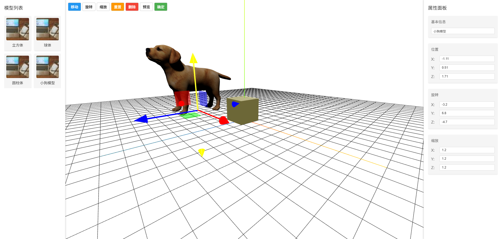

```markdown
# Intoo Editor - 基于Vue和Three.js的3D场景编辑器



Intoo Editor是一个高度封装的3D场景编辑器，基于Vue 3和Three.js构建，提供直观的拖拽式界面，让您轻松创建和编辑3D场景。

## ✨ 特性亮点

- 🖱️ **直观的拖拽操作** - 通过简单的拖放即可将素材添加到场景
- 🛠️ **实时编辑** - 使用TransformControls调整位置、旋转和缩放
- 🔄 **双向同步** - 场景编辑与属性面板实时同步
- 🧩 **模块化设计** - 轻松对接自定义素材接口
- 🖼️ **多素材支持** - 支持3D模型、图片和视频素材
- 📦 **开箱即用** - 高度封装，快速集成到现有项目

## 🚀 快速开始
- Node版本：22.14.0

### 安装


### 基本使用

```javascript
import IntooEditor from 'intoo-editor'

// 在你的Vue组件中
<template>
  <IntooEditor :assets="yourAssets" @scene-change="handleSceneChange" />
</template>
```

## 🎮 使用指南

### 三栏布局

1. **左侧面板** - 素材列表，支持自定义数据源
2. **中间区域** - 3D场景编辑器，支持拖拽和实时编辑
3. **右侧面板** - 属性编辑器，显示和修改选中素材属性

### 核心功能

- **拖拽添加**：从左侧面板拖拽素材到场景
- **变换控制**：选中场景中的对象，使用TransformControls调整
- **属性同步**：右侧面板实时显示并允许编辑选中对象属性
- **数据导出**：获取包含所有场景对象的完整数据

## 📚 API参考

### Props

| 参数 | 说明 | 类型 | 默认值 |
|------|------|------|--------|
| assets | 素材列表数据 | Array | [] |
| initialScene | 初始场景数据 | Object | null |

### Events

| 事件名 | 说明 | 回调参数 |
|-------|------|---------|
| scene-change | 场景变化时触发 | 场景对象数组 |
| asset-selected | 素材被选中时触发 | 选中素材对象 |

## 🌱 开发计划

- [ ] 图片素材支持
- [ ] 视频素材支持
- [ ] 场景保存/加载功能
- [ ] 多光源控制
- [ ] 材质编辑器

## 🤝 贡献指南

我们欢迎所有形式的贡献！请阅读我们的[贡献指南](CONTRIBUTING.md)。

## 📄 许可证

MIT © [RedWait]

---

💡 **提示**：项目正在积极开发中，欢迎提交issue和PR！
```

